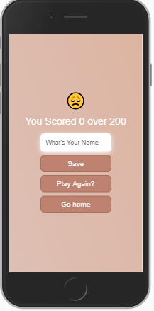
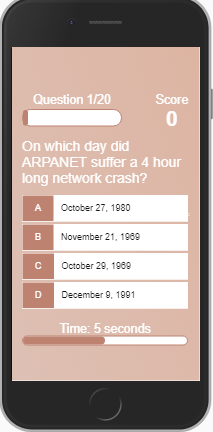

# Trivia Quiz App

The Trivia Quiz App is a Progressive web app with its questions gotten from the Open Trivia DB Database

It is built with just HTML, CSS and JavaScript. No frameworks, No Libraries.

There are four categories and 20 questions for each round.

See demo at https://linda-ikechukwu.github.io/Simple-Quiz-App/src/index.html

  

To get a working copy of this app on your local machine run the following commands on your cmd;

* git clone https://github.com/Linda-Ikechukwu/Simple-Quiz-App
* npm install 

Access at bit.ly/TrivaQuiz
